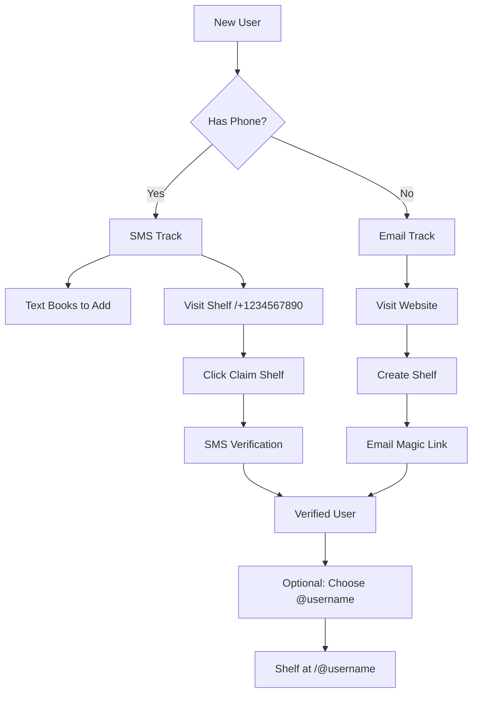

# Simplified Dual-Track Authentication Design

**Date:** December 8, 2025
**Status:** Proposed
**Estimated Implementation:** 2-3 days

## Executive Summary

Replace the complex Supabase Auth magic link system with a simpler dual-track approach that supports both phone-first users (SMS) and email-only users, while maintaining the simplicity of the existing SMS flow. This approach eliminates the cookie propagation issues and reduces code complexity by ~60%.

### Critical Design Decisions

1. **No UUID Migration:** Keep `phone_number` as primary key to avoid breaking changes
   - Sessions table uses `user_id TEXT REFERENCES users(phone_number)`
   - All code uses `user.phone_number`, never `user.id`
   - Email users get synthetic phone numbers like `email_user_{uuid}`

2. **Proper Email User Handling:** Check for existing users before insert
   - `getOrCreateUser` checks for existing email users first
   - Prevents unique constraint violations on second login
   - All verification codes must specify `code_type` field

3. **Persistent Rate Limiting:** Use database tables instead of in-memory storage
   - `ip_rate_limits` table for IP-based limiting
   - `verification_rate_limits` table for per-identifier limiting

4. **Proper PostgreSQL Syntax:** Use partial unique indexes, not inline constraints
   - `CREATE UNIQUE INDEX ... WHERE` instead of inline `CONSTRAINT ... WHERE`

5. **Atomic Operations:** Use SQL functions/RPC for increment operations
   - Separate code lookup from increment to handle null cases
   - Alternative function to increment by identifier when code not found

## Problem Statement

The current authentication implementation has fundamental issues:
1. **Cookie propagation failure:** Client-side Supabase Auth doesn't properly sync with server-side session cookies
2. **Over-complexity:** ~800 lines of code for a simple claiming flow
3. **Poor user experience:** Multiple redirects and verification steps
4. **Broken state:** Syntax errors and non-functional endpoints

## Design Goals

1. **Prevent unauthorized phone number claiming** (primary goal)
2. **Maintain SMS simplicity** for existing users
3. **Support users without phones** via email
4. **Ship quickly** (2-3 days, not weeks)
5. **Clean, maintainable code** (~300 lines total)

## Proposed Solution: Dual-Track Progressive Authentication

### Core Concept

Two parallel paths that converge to the same result - a verified user account:



### Track 1: Phone-First (Existing Users)

1. Users continue texting books to add them (unchanged)
2. Shelf URL remains `/+15551234567` initially
3. Can visit shelf on web without auth (read-only)
4. To customize: Click "Claim This Shelf"
5. Enter phone → receive SMS code → verified
6. Optionally set username for pretty URLs
7. No email required

### Track 2: Email-First (New Users)

1. Visit site, click "Create Shelf"
2. Enter email → receive magic link
3. Click link → SERVER-SIDE verification
4. Choose username immediately
5. Start adding books via web
6. Optionally add phone later

## Critical Issue: UUID Migration Strategy

### Current State Analysis
The existing system uses `phone_number` (TEXT) as the primary key and foreign key throughout:
- **books table:** `user_id` column stores phone numbers
- **shelves table:** `user_id` column stores phone numbers
- **book_shelves:** References books and shelves (indirect user reference)
- **failed_book_imports:** `user_id` stores phone numbers
- **sms_context:** `user_id` stores phone numbers
- **All API endpoints:** Use phone number for user identification
- **SMS handler:** Upserts books with phone number as user_id

### Migration Approach: Keep Phone Numbers as Primary Key

**IMPORTANT DECISION:** Instead of migrating to UUID primary keys, we'll keep using phone numbers as the primary identifier to avoid breaking changes. This dramatically simplifies the implementation.

```sql
-- Modified users table - phone_number remains the PRIMARY KEY
CREATE TABLE users (
    phone_number TEXT PRIMARY KEY,  -- Keep as primary key!
    email TEXT UNIQUE,
    username TEXT UNIQUE,
    display_name TEXT,
    verified_at TIMESTAMP,
    created_at TIMESTAMP DEFAULT NOW(),

    -- Optional UUID for future use (not used as FK)
    internal_id UUID DEFAULT gen_random_uuid(),

    -- Username only after verification
    CONSTRAINT username_requires_verification CHECK (
        username IS NULL OR verified_at IS NOT NULL
    )
);
```

This approach means:
1. **No migration needed** for books, shelves, book_shelves tables
2. **No code changes** to existing SMS handlers
3. **No risk** of breaking existing user data
4. **Email users** get a generated phone_number like 'email_user_{uuid}'

### Handling Email-Only Users

```typescript
// Helper function that ALWAYS returns user with phone_number as PK
async function getOrCreateUser(params: { phone?: string, email?: string }) {
    if (params.phone) {
        // Phone user - phone_number is the natural PK
        const { data: existing } = await supabase
            .from('users')
            .select('*')
            .eq('phone_number', params.phone)
            .single();

        if (existing) return existing;

        const { data: newUser } = await supabase
            .from('users')
            .insert({
                phone_number: params.phone,
                verified_at: new Date().toISOString()
            })
            .select()
            .single();

        return newUser; // newUser.phone_number is the PK
    } else if (params.email) {
        // Email user - check for existing first!
        const { data: existing } = await supabase
            .from('users')
            .select('*')
            .eq('email', params.email)
            .single();

        if (existing) return existing; // Return existing email user

        // Only create new user if email doesn't exist
        const fakePhoneNumber = `email_user_${crypto.randomUUID()}`;

        const { data: user } = await supabase
            .from('users')
            .insert({
                phone_number: fakePhoneNumber,  // Satisfies PK requirement
                email: params.email,
                verified_at: new Date().toISOString()
            })
            .select()
            .single();

        return user; // user.phone_number is the PK (synthetic)
    }
}

// URL routing for email users
// They'll use /user/{fake-phone-number} until they claim a username
// Then they can use /@username
```

## Technical Architecture

### Database Schema

```sql
-- Users table - phone_number remains PRIMARY KEY for backward compatibility
CREATE TABLE users (
    phone_number TEXT PRIMARY KEY,  -- Keep as PK to avoid migration!
    email TEXT UNIQUE,
    username TEXT UNIQUE,
    display_name TEXT,
    verified_at TIMESTAMP,
    created_at TIMESTAMP DEFAULT NOW(),

    -- For email-only users, generate: 'email_user_' || gen_random_uuid()
    -- This allows email users while keeping phone_number as PK

    -- Username only after verification
    CONSTRAINT username_requires_verification CHECK (
        username IS NULL OR verified_at IS NOT NULL
    )
);

-- Secure session management with hashed tokens
CREATE TABLE sessions (
    token_hash TEXT PRIMARY KEY,  -- Store SHA256 hash, not plaintext
    user_id TEXT REFERENCES users(phone_number) ON DELETE CASCADE,  -- References phone_number!
    created_at TIMESTAMP DEFAULT NOW(),
    expires_at TIMESTAMP DEFAULT NOW() + INTERVAL '7 days',  -- Shorter TTL
    last_activity TIMESTAMP DEFAULT NOW()  -- For activity-based refresh
);

-- Verification codes with enhanced security
CREATE TABLE verification_codes (
    id UUID PRIMARY KEY DEFAULT gen_random_uuid(),
    identifier TEXT NOT NULL,  -- phone or email
    code TEXT NOT NULL,
    code_type TEXT NOT NULL CHECK (code_type IN ('sms_6digit', 'email_token')),
    attempts INTEGER DEFAULT 0,  -- Track failed attempts
    created_at TIMESTAMP DEFAULT NOW(),
    expires_at TIMESTAMP DEFAULT NOW() + INTERVAL '10 minutes',
    used_at TIMESTAMP,
    ip_address TEXT  -- Track origin for security
);

-- CORRECT SYNTAX: Partial unique index instead of inline constraint
CREATE UNIQUE INDEX idx_one_active_code_per_identifier
ON verification_codes(identifier, code_type)
WHERE used_at IS NULL;

-- Per-identifier rate limiting (persisted in database)
CREATE TABLE verification_rate_limits (
    identifier TEXT PRIMARY KEY,
    attempts_today INTEGER DEFAULT 1,
    attempts_this_hour INTEGER DEFAULT 1,
    last_attempt TIMESTAMP DEFAULT NOW(),
    hour_reset_at TIMESTAMP DEFAULT NOW() + INTERVAL '1 hour',
    day_reset_at TIMESTAMP DEFAULT NOW() + INTERVAL '1 day'
);

-- IP rate limiting (persisted in database)
CREATE TABLE ip_rate_limits (
    ip_address TEXT PRIMARY KEY,
    attempts INTEGER DEFAULT 1,
    window_start TIMESTAMP DEFAULT NOW(),
    window_end TIMESTAMP DEFAULT NOW() + INTERVAL '1 hour'
);

-- Indexes for performance
CREATE INDEX idx_sessions_user_id ON sessions(user_id);
CREATE INDEX idx_sessions_expires ON sessions(expires_at);
CREATE INDEX idx_verification_codes_identifier ON verification_codes(identifier);
CREATE INDEX idx_verification_codes_expires ON verification_codes(expires_at);
CREATE INDEX idx_ip_rate_limits_window ON ip_rate_limits(window_end);
```

### Session Management

**No Supabase Auth!** Secure cookie-based sessions with token hashing:

```typescript
// src/lib/server/auth.ts
import { randomBytes, createHash } from 'crypto';
import { dev } from '$app/environment';

// Generate secure token and hash
export function generateSessionToken(): { token: string; hash: string } {
    const token = randomBytes(32).toString('base64url');
    const hash = createHash('sha256').update(token).digest('hex');
    return { token, hash };
}

// Environment-aware cookie settings
export const COOKIE_OPTIONS = {
    path: '/',
    httpOnly: true,
    secure: !dev,  // Only require HTTPS in production
    sameSite: 'lax' as const,
    maxAge: 60 * 60 * 24 * 7  // 7 days
};

// hooks.server.ts
export const handle: Handle = async ({ event, resolve }) => {
    const sessionToken = event.cookies.get('tbr_session');

    if (sessionToken) {
        // Hash the token to look up in database
        const tokenHash = createHash('sha256').update(sessionToken).digest('hex');

        // Validate session (join using phone_number)
        const { data: session } = await supabase
            .from('sessions')
            .select(`
                *,
                user:users!user_id(*)
            `)
            .eq('token_hash', tokenHash)
            .gt('expires_at', new Date().toISOString())
            .single();

        if (session) {
            event.locals.user = session.user;

            // Refresh activity timestamp
            await supabase.from('sessions')
                .update({ last_activity: new Date().toISOString() })
                .eq('token_hash', tokenHash);
        }
    }

    return resolve(event);
};
```

### Verification Flows

#### Phone Verification (With Rate Limiting)
```typescript
// /api/auth/send-code
export async function POST({ request, getClientAddress }) {
    const { phone } = await request.json();
    const ip = getClientAddress();

    // Check IP rate limit (3 per hour) - using persistent database
    if (!await checkIPRateLimit(ip)) {
        return json({ error: 'Too many attempts' }, { status: 429 });
    }

    // Check identifier rate limit (5 per day)
    const { data: rateLimit } = await supabase
        .from('verification_rate_limits')
        .select('*')
        .eq('identifier', phone)
        .single();

    if (rateLimit && rateLimit.attempts_today >= 5) {
        return json({ error: 'Daily limit reached' }, { status: 429 });
    }

    // Delete existing unused codes (unique constraint enforces too)
    await supabase.from('verification_codes')
        .delete()
        .eq('identifier', phone)
        .is('used_at', null);

    const code = Math.floor(100000 + Math.random() * 900000).toString();

    // Store code with metadata
    await supabase.from('verification_codes').insert({
        identifier: phone,
        code,
        code_type: 'sms_6digit',
        ip_address: ip
    });

    // Update rate limits
    await supabase.from('verification_rate_limits')
        .upsert({
            identifier: phone,
            attempts_today: (rateLimit?.attempts_today || 0) + 1,
            last_attempt: new Date().toISOString()
        });

    // Send SMS
    await twilioClient.messages.create({
        to: phone,
        from: TWILIO_PHONE,
        body: `Your TBR.fyi code: ${code}`
    });

    return json({ success: true });
}

// /api/auth/verify-phone
export async function POST({ request, cookies }) {
    const { phone, code } = await request.json();

    // First, check if there's an active code for this identifier
    const { data: activeCode } = await supabase
        .from('verification_codes')
        .select('*')
        .eq('identifier', phone)
        .eq('code_type', 'sms_6digit')
        .is('used_at', null)
        .gt('expires_at', new Date().toISOString())
        .single();

    // If no active code exists, fail immediately
    if (!activeCode) {
        return error(400, 'No active verification code');
    }

    // Check if the provided code matches
    if (activeCode.code !== code) {
        // Wrong code - increment attempts on the active code
        const { data: attempts } = await supabase.rpc(
            'increment_verification_attempts',
            { code_id: activeCode.id }
        );

        if (attempts >= 3) {
            // Lock out this code
            await supabase.from('verification_codes')
                .update({ used_at: new Date().toISOString() })
                .eq('id', activeCode.id);
            return error(400, 'Too many failed attempts');
        }

        return error(400, 'Invalid code');
    }

    // Code is valid - mark as used
    await supabase.from('verification_codes')
        .update({ used_at: new Date().toISOString() })
        .eq('id', activeCode.id);

    // Get or create user (returns record with phone_number as PK)
    const user = await getOrCreateUser({ phone });
    // user.phone_number is the primary key, NOT user.id

    // Create session with hashed token
    const { token, hash } = generateSessionToken();
    await supabase.from('sessions').insert({
        token_hash: hash,
        user_id: user.phone_number  // PK is phone_number, not id!
    });

    // Set cookie (raw token)
    cookies.set('tbr_session', token, COOKIE_OPTIONS);

    return json({ user });
}
```

#### Email Magic Link (Server-Side)
```typescript
// /api/auth/send-magic-link
export async function POST({ request, getClientAddress }) {
    const { email } = await request.json();
    const ip = getClientAddress();

    // Check rate limits
    if (!await checkIPRateLimit(ip)) {
        return json({ error: 'Too many attempts' }, { status: 429 });
    }

    // Delete existing unused codes for this email
    await supabase.from('verification_codes')
        .delete()
        .eq('identifier', email)
        .eq('code_type', 'email_token')  // Must specify type!
        .is('used_at', null);

    const token = randomBytes(32).toString('base64url');

    // Store token with proper code_type
    await supabase.from('verification_codes').insert({
        identifier: email,
        code: token,
        code_type: 'email_token',  // REQUIRED: Must specify email_token type
        ip_address: ip
    });

    // Send email
    const link = `${PUBLIC_BASE_URL}/auth/confirm?token=${token}&email=${email}`;
    await sendEmail(email, 'Click to verify', link);

    return json({ success: true });
}

// /auth/confirm - SERVER-SIDE route
export async function GET({ url, cookies }) {
    const token = url.searchParams.get('token');
    const email = url.searchParams.get('email');

    // Verify token (check it exists and is valid)
    const { data: verificationCode } = await supabase
        .from('verification_codes')
        .select('*')
        .eq('identifier', email)
        .eq('code', token)
        .eq('code_type', 'email_token')  // Must check email_token type
        .is('used_at', null)
        .gt('expires_at', new Date().toISOString())
        .single();

    if (!verificationCode) {
        return redirect(307, '/auth/verify-email?error=invalid');
    }

    // Mark token as used
    await supabase.from('verification_codes')
        .update({ used_at: new Date().toISOString() })
        .eq('id', verificationCode.id);

    // Get or create user - handles existing email users correctly!
    const user = await getOrCreateUser({ email });

    // Create session with phone_number as user_id
    const { token: sessionToken, hash } = generateSessionToken();
    await supabase.from('sessions').insert({
        token_hash: hash,
        user_id: user.phone_number  // Use phone_number (real or synthetic)
    });

    cookies.set('tbr_session', sessionToken, COOKIE_OPTIONS);

    // Redirect to username selection (new users) or shelf (existing users)
    if (!user.username) {
        return redirect(307, '/auth/username');
    } else {
        return redirect(307, `/@${user.username}`);
    }
}
```

### URL Routing & Nested Routes

Support three URL formats with all nested routes:
1. `/@username` - Claimed usernames
2. `/+15551234567` - Phone numbers (backward compatible)
3. `/user/{uuid}` - Fallback for users without phone or username

All formats support nested routes like `/settings`, `/books`, etc.

```typescript
// src/routes/[identifier]/+layout.server.ts (NEW - handles ALL nested routes)
export const load = async ({ params }) => {
    const { identifier } = params;

    let user;
    if (identifier.startsWith('@')) {
        // Username lookup
        user = await getUserByUsername(identifier.slice(1));
    } else if (identifier.startsWith('+')) {
        // Phone lookup
        user = await getUserByPhone(identifier);
    } else if (identifier.match(/^[a-f0-9-]{36}$/)) {
        // UUID lookup
        user = await getUserById(identifier);
    }

    if (!user) throw error(404, 'User not found');

    // This data is available to all nested routes
    return { user };
};

// This layout approach handles:
// - /[identifier] (main shelf page)
// - /[identifier]/settings
// - /[identifier]/books
// - /[identifier]/any-future-route
```

## Migration Plan

### Phase 0: Cleanup & Supabase Auth Removal (30 minutes)

#### Disable Supabase Auth Infrastructure
1. **Create migration to disable triggers:**
   ```sql
   -- 012_disable_auth_triggers.sql
   DROP TRIGGER IF EXISTS on_auth_user_created ON auth.users;
   DROP TRIGGER IF EXISTS on_auth_user_updated ON auth.users;
   DROP TRIGGER IF EXISTS on_auth_user_deleted ON auth.users;

   -- Clear auth_id to prevent confusion
   UPDATE users SET auth_id = NULL WHERE auth_id IS NOT NULL;
   ```

2. **Remove authentication code:**
   - Delete `src/lib/components/AuthHandler.svelte`
   - Delete `src/routes/auth/callback/+page.svelte`
   - Delete `src/routes/auth/claim/+page.svelte`
   - Delete `src/routes/auth/verify/+page.svelte`
   - Delete `src/routes/api/auth/session/` directory
   - Delete `AUTH_MAGIC_LINK_ISSUE.md`

3. **Revert modified files:**
   - Simplify `src/hooks.server.ts` (remove Supabase Auth)
   - Clean `src/routes/+layout.svelte` (remove AuthHandler)
   - Simplify `src/lib/stores/auth.ts`
   - Clean `src/lib/supabase.ts` (remove auth config)

### Phase 1: Core Session System (Day 1 Morning)
1. **Create database tables and functions:**
   - sessions table (with token_hash)
   - verification_codes table
   - verification_rate_limits table
   - ip_rate_limits table
   - Partial unique index for active codes
   - SQL functions for atomic increments:
     - `increment_ip_attempts()`
     - `increment_identifier_attempts()`
     - `increment_verification_attempts()`
2. Implement session management in hooks.server.ts
3. Create /api/auth/session endpoint
4. Test with hardcoded user

### Phase 2: Phone Verification (Day 1 Afternoon)
1. Build /auth/verify-phone page
2. Implement SMS code sending
3. Create verification endpoints
4. Test with existing phone users

### Phase 3: Email Magic Links (Day 2 Morning)
1. Build /auth/verify-email page
2. Implement server-side /auth/confirm
3. Email sending integration
4. Test email-only flow

### Phase 4: Username & Polish (Day 2 Afternoon)
1. Update /auth/username page
2. Implement URL routing logic
3. Update existing shelf pages
4. Add login/logout UI

### Phase 5: Testing & Documentation (Day 3)
1. Test all flows end-to-end
2. Verify backward compatibility
3. Update CLAUDE.md
4. Write user documentation

## Comparison with Current Approach

| Aspect | Current (Failed) | Proposed |
|--------|-----------------|----------|
| **Lines of Code** | ~800 | ~300 |
| **Dependencies** | Supabase Auth, multiple clients | Just Supabase (DB only) |
| **Cookie Handling** | Client/server mismatch | Server-only, simple |
| **Complexity** | High (auth_id mapping, triggers) | Low (direct user table) |
| **Debug-ability** | Hard (multiple systems) | Easy (single flow) |
| **Time to Ship** | Unknown (stuck for days) | 2-3 days |

## What We're NOT Building (YAGNI)

1. **Password reset flows** - Can add later if needed
2. **Account linking** - Phone + email on same account (v2)
3. **2FA** - Not needed for book tracking
4. **OAuth/Social login** - Adds complexity
5. **Admin panels** - Direct database access is fine
6. **Email verification resend** - Magic links work once
7. **Complex permission systems** - Just "owns shelf or doesn't"

## Success Metrics

1. **Working authentication in 2-3 days**
2. **Zero cookie propagation issues**
3. **Existing SMS users unaffected**
4. **New email users can sign up**
5. **Clean git history** (remove failed attempt)

## Security Considerations

### Session Security
- **Token hashing:** Store SHA256 hash in database, not plaintext tokens
- **Shorter TTL:** 7-day expiry with activity-based refresh (vs 30 days)
- **Secure cookies:** HTTP-only, secure flag (HTTPS in production), SameSite=lax
- **Logout support:** Explicit session invalidation endpoint

### Verification Code Protection
- **Unique constraint:** One active code per identifier at a time
- **Rate limiting:**
  - IP-based: 3 attempts per hour
  - Per-identifier: 5 codes per day
  - Failed attempts: Max 3 per code
- **Code types:** Separate 6-digit SMS from email tokens
- **Automatic cleanup:** Expired codes removed by cron job

### Development vs Production
- **Cookie security:** Conditional `secure` flag based on environment
- **HTTPS enforcement:** Only in production
- **Debug logging:** Security events logged but sanitized

### Rate Limiting Implementation (Persistent)

```typescript
// Persistent IP rate limiting using database
export async function checkIPRateLimit(ip: string): Promise<boolean> {
    const now = new Date();
    const limit = 3;

    // Check existing rate limit
    const { data: rateLimit } = await supabase
        .from('ip_rate_limits')
        .select('*')
        .eq('ip_address', ip)
        .gt('window_end', now.toISOString())
        .single();

    if (!rateLimit) {
        // Create new window
        await supabase.from('ip_rate_limits').upsert({
            ip_address: ip,
            attempts: 1,
            window_start: now.toISOString(),
            window_end: new Date(now.getTime() + 60 * 60 * 1000).toISOString()
        });
        return true;
    }

    if (rateLimit.attempts >= limit) {
        return false; // Rate limited
    }

    // Increment atomically using Supabase RPC
    await supabase.rpc('increment_ip_attempts', { ip_addr: ip });
    return true;
}

// SQL function for atomic increment (add to migration)
CREATE OR REPLACE FUNCTION increment_ip_attempts(ip_addr TEXT)
RETURNS void AS $$
BEGIN
    UPDATE ip_rate_limits
    SET attempts = attempts + 1
    WHERE ip_address = ip_addr
    AND window_end > NOW();
END;
$$ LANGUAGE plpgsql;

// Similar for identifier rate limiting
CREATE OR REPLACE FUNCTION increment_identifier_attempts(ident TEXT)
RETURNS void AS $$
BEGIN
    UPDATE verification_rate_limits
    SET
        attempts_today = CASE
            WHEN day_reset_at > NOW() THEN attempts_today + 1
            ELSE 1
        END,
        attempts_this_hour = CASE
            WHEN hour_reset_at > NOW() THEN attempts_this_hour + 1
            ELSE 1
        END,
        hour_reset_at = CASE
            WHEN hour_reset_at <= NOW() THEN NOW() + INTERVAL '1 hour'
            ELSE hour_reset_at
        END,
        day_reset_at = CASE
            WHEN day_reset_at <= NOW() THEN NOW() + INTERVAL '1 day'
            ELSE day_reset_at
        END,
        last_attempt = NOW()
    WHERE identifier = ident;

    -- Insert if doesn't exist
    IF NOT FOUND THEN
        INSERT INTO verification_rate_limits (identifier)
        VALUES (ident);
    END IF;
END;
$$ LANGUAGE plpgsql;
```

### Atomic Increment for Verification Attempts

```sql
-- SQL function for atomic attempt increment (by ID)
CREATE OR REPLACE FUNCTION increment_verification_attempts(code_id UUID)
RETURNS INTEGER AS $$
DECLARE
    current_attempts INTEGER;
BEGIN
    UPDATE verification_codes
    SET attempts = attempts + 1
    WHERE id = code_id
    RETURNING attempts INTO current_attempts;

    RETURN current_attempts;
END;
$$ LANGUAGE plpgsql;

-- Alternative: Increment by identifier + code (for invalid code tracking)
CREATE OR REPLACE FUNCTION increment_failed_attempts(
    p_identifier TEXT,
    p_code_type TEXT
) RETURNS INTEGER AS $$
DECLARE
    current_attempts INTEGER;
BEGIN
    -- Find active code for this identifier and increment
    UPDATE verification_codes
    SET attempts = attempts + 1
    WHERE identifier = p_identifier
    AND code_type = p_code_type
    AND used_at IS NULL
    AND expires_at > NOW()
    RETURNING attempts INTO current_attempts;

    -- Return current attempts or 0 if no active code
    RETURN COALESCE(current_attempts, 0);
END;
$$ LANGUAGE plpgsql;
```

Usage in TypeScript:
```typescript
// When we have a valid activeCode record
const { data: attempts } = await supabase
    .rpc('increment_verification_attempts', { code_id: activeCode.id });

// Alternative when we only have identifier
const { data: attempts } = await supabase
    .rpc('increment_failed_attempts', {
        p_identifier: phone,
        p_code_type: 'sms_6digit'
    });
```

## Risks & Mitigations

| Risk | Mitigation |
|------|------------|
| Breaking existing users | Test thoroughly with phone data |
| Email deliverability | Use existing email service |
| Session hijacking | Token hashing, HTTP-only cookies, activity timeout |
| Brute force attacks | Rate limiting, attempt counters, unique constraints |
| Token collisions | Crypto.randomBytes(32) for tokens |
| Development security | Environment-aware secure flags |
| Nested route breakage | Use layout.server.ts for all identifier routes |

## Implementation Checklist

```markdown
## Cleanup & Auth Removal
- [ ] Backup current branch
- [ ] Create 012_disable_auth_triggers.sql migration
- [ ] Drop auth.users triggers
- [ ] Clear auth_id references
- [ ] Delete AuthHandler.svelte
- [ ] Delete auth/callback page
- [ ] Delete auth/claim page
- [ ] Delete auth/verify page (broken)
- [ ] Delete api/auth/session directory
- [ ] Delete AUTH_MAGIC_LINK_ISSUE.md
- [ ] Revert hooks.server.ts
- [ ] Revert +layout.svelte
- [ ] Simplify auth store
- [ ] Clean supabase.ts

## Database Setup
- [ ] Create sessions table with token_hash
- [ ] Create verification_codes table with constraints
- [ ] Create verification_rate_limits table
- [ ] Update users table schema
- [ ] Add UUID to existing users
- [ ] Create indexes for performance

## Security Implementation
- [ ] Implement token hashing (SHA256)
- [ ] Add IP rate limiting (3/hour)
- [ ] Add identifier rate limiting (5/day)
- [ ] Set up attempt counters
- [ ] Configure environment-aware cookies
- [ ] Add CSRF protection

## Phone Flow
- [ ] /auth/verify-phone page
- [ ] SMS code generation (6 digits)
- [ ] Rate-limited send endpoint
- [ ] Code verification with attempts
- [ ] Twilio integration
- [ ] Test with real phone

## Email Flow
- [ ] /auth/verify-email page
- [ ] Secure token generation
- [ ] Rate-limited send endpoint
- [ ] Server-side /auth/confirm route
- [ ] Email sending integration
- [ ] Test email flow

## Session Management
- [ ] Session creation with hashing
- [ ] Cookie setting (dev/prod aware)
- [ ] Session validation in hooks
- [ ] Activity-based refresh
- [ ] Logout endpoint
- [ ] Session cleanup cron

## Username & Routing
- [ ] Create [identifier]/+layout.server.ts
- [ ] Username selection page
- [ ] Username availability check
- [ ] Support @username URLs
- [ ] Support +phone URLs
- [ ] Support /user/uuid URLs
- [ ] Test nested routes (/settings, etc)

## Testing & Validation
- [ ] Phone user can claim shelf
- [ ] Email user can create shelf
- [ ] Existing data works
- [ ] All URL formats resolve
- [ ] Nested routes work
- [ ] Sessions persist correctly
- [ ] Rate limiting works
- [ ] Development cookies work
- [ ] Production security enabled
```

## Summary of Critical Fixes

### Issues Addressed

1. **UUID Migration (HIGH):** Avoided entirely by keeping `phone_number` as primary key
   - No foreign key updates needed
   - No risk to existing data
   - Email users get synthetic phone_numbers
   - **FIXED:** All session code now uses `user.phone_number` not `user.id`

2. **Null Verification RPC (HIGH):** Fixed attempt tracking logic
   - **FIXED:** Separated code lookup from increment
   - Check for active code first, then increment if wrong
   - Added alternative RPC function for identifier-based increment

3. **Missing code_type in Email Flow (HIGH):** Fixed NOT NULL constraint violation
   - **FIXED:** All email verification inserts include `code_type: 'email_token'`
   - Email token queries properly filter by `code_type`
   - Prevents constraint violations on insert

4. **Duplicate Email User Creation (HIGH):** Fixed unique constraint violation
   - **FIXED:** `getOrCreateUser` now checks for existing email users first
   - Only creates new user if email doesn't exist
   - Returns existing user on subsequent logins

5. **PostgreSQL Syntax (MEDIUM):** Fixed partial unique constraint
   - Uses proper `CREATE UNIQUE INDEX ... WHERE` syntax
   - Will execute without errors

6. **Persistent Rate Limiting (MEDIUM):** Moved to database storage
   - Survives restarts and scales across instances
   - Uses dedicated tables with time windows
   - Atomic increment via SQL functions

7. **Atomic Increments (MEDIUM):** Uses Supabase RPC functions
   - No `sql`` template literal needed
   - Proper PostgreSQL functions for atomic updates
   - Returns current count for validation

## Conclusion

This simplified approach:
1. **Solves the immediate problem** (prevent unauthorized claiming)
2. **Maintains simplicity** for SMS users
3. **Supports email users** without complexity
4. **Ships quickly** with minimal code
5. **Avoids the pitfalls** of the current implementation

The key insight: We don't need Supabase Auth. A simple session table and server-side cookie management eliminates all the client/server synchronization issues while reducing code complexity by 60%.

Ready to proceed with implementation?